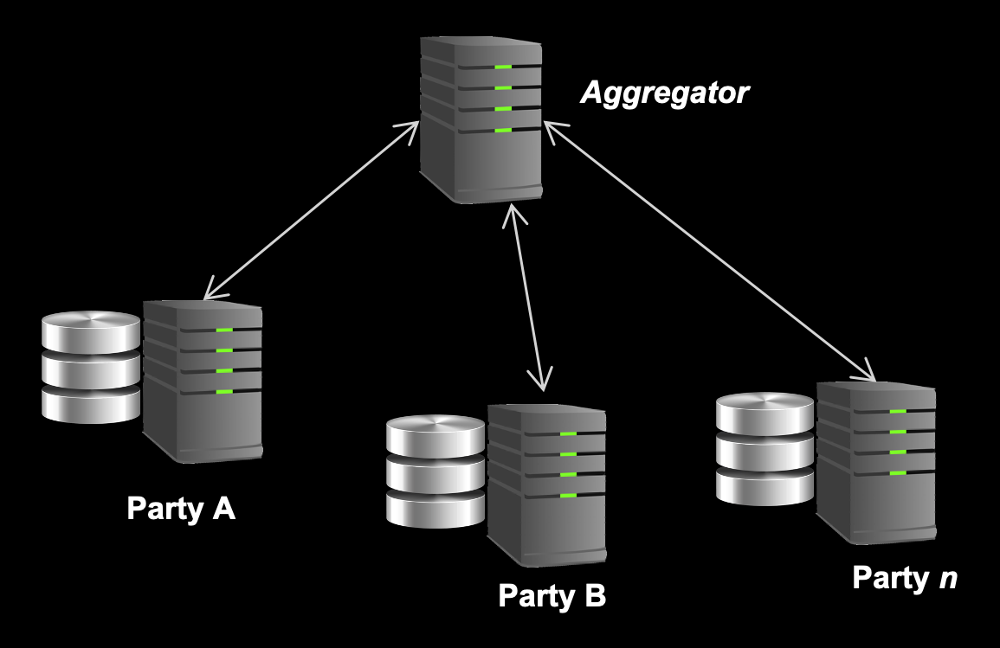

# <d></d>  IBM Federated Learning  

## What is it?

IBM federated learning is a Python framework for federated learning (FL) in an enterprise environment. FL is a distributed machine learning process, in which each participant node (or party) retains data locally and interacts with the other participants via a learning protocol. The main drivers behind FL are privacy and confidentiality concerns, regulatory compliance requirements, as well as the practicality of moving data to one central learning location.

IBM federated learning provides a basic fabric for FL, to which advanced features can be added. It is not dependent on any specific machine learning framework and supports different learning topologies, e.g., a shared aggregator, and protocols. It supports Deep Neural Networks (DNNs) as well as classic machine learning techniques such as linear regression and k-means. This comprises supervised and unsupervised approaches as well as reinforcement learning. The figure below shows a typical configuration of an aggregator based federated learning setup supported by IBM federated learning.

<p align="center">
  
</p>

A set of parties own data and each trains a local model. The parties exchange updates with an aggregator using a FL protocol. The aggregator fuses (aggregates) the results from the different parties and ships the consolidated results back to the parties. This can go through multiple rounds until a termination criterion is reached. IBM federated learning supports the configuration of these training scenarios.

The key design points of IBM federated learning are the ease of use for the machine learning professional, configurability to different computational environments - from data centers to edge devices - and extensibility. It can be extended to work with different machine learning (ML) libraries, learning protocols, and fusion algorithms. This provides a basic fabric on which FL projects can be run and research in FL learning can take place.

IBM federated learning comes with a large library of fusion algorithms for both DNNs and classic ML approaches, consisting of implementations of both common, published fusion algorithms as well as novel ones we have developed.

## Supported functionality

IBM federated learning supports the following machine learning model types:

- Neural networks (any neural network topology supported by Keras, PyTorch and Tensorflow)
- Decision Tree ID3
- Linear classifiers/regressions (with regularizer): logistic regression, linear SVM, ridge regression, Kmeans and Naïve Bayes
- Deep Reinforcement Learning algorithms including DQN, DDPG, PPO and more

IBM federated learning supports multiple state-of-the-art fusion algorithms to combine model updates coming from multiple parties. Changes in this algorithm may speed up the convergence, reduce training time or improve model robustness.
For a particular ML model, you can select multiple types of fusion algorithms:

| *Supported ML Models* | *Supported fusion algorithms* |
| --- | --- |
| Neural Networks | Iterative Average |
|     | FedAvg  [McMahan et al.](https://arxiv.org/abs/1602.05629) |
|     | Gradient Average |
|     | PFNM  [Yurochkin et al.](https://arxiv.org/abs/1905.12022) |
|     | Krum [Blanchard et al.](https://papers.nips.cc/paper/6617-machine-learning-with-adversaries-byzantine-tolerant-gradient-descent.pdf) |
|     | Coordinate-wise median [Yin et al.](https://arxiv.org/abs/1803.01498) |
|     | Zeno [Xie et al.](https://arxiv.org/abs/1805.10032) |
|     | SPAHM [Yurochkin et al.](https://arxiv.org/abs/1911.00218) |
|     | Fed+ [Yu et al.](https://arxiv.org/abs/2009.06303) |
|     | FedProx: [Tian Li et al.](https://arxiv.org/abs/1812.06127) |
|     | Shuffle Iterative Average [Cheng et al.](https://arxiv.org/abs/2105.09400)|
|     | Comparative Elimination [Gupta et al.](https://arxiv.org/abs/2108.11769) |
|     | Adaptive Federated Averaging [Muñoz-González et al.](https://arxiv.org/abs/1909.05125) |
| ID3 Decision Tree | ID3 fusion [Quinlan](https://link.springer.com/article/10.1007/BF00116251) |
| Reinforcement Learning RLLib models | Iterative Average |
|     | FedAvg [McMahan et al.](https://arxiv.org/abs/1602.05629) |
| Linear classifiers with SGD | Iterative Average |
| K-means | SPAHM [Yurochkin et al.](https://arxiv.org/abs/1911.00218) |
| Naïve Bayes | Naive Bayes fusion with differential privacy|

We also support the following fairness techniques that help to mitigate bias in federated learning and can be coupled for multiple types of ML models:

| *Fairness techniques* | *Algorithm types* | *Supported ML models* |
| --- | --- | --- |
| Local Reweighing [Abay et al.](https://arxiv.org/abs/2012.02447)| Pre-processing | All ML models |
| Global Reweighing with Differetial Privacy [Abay et al.](https://arxiv.org/abs/2012.02447)| Pre-processing | All ML models |
| Federated Prejudice Removal [Abay et al.](https://arxiv.org/abs/2012.02447) | In-processing | Logistic Regression |

In order to aid orchestration of Federated Learning experiments using the IBMFL library, we also provide a Jupyter Notebook based UI interface, [Experiment Manager Dashboard](experiment_manager/Experiment_Manager_dashboard.ipynb) where users can choose the model, fusion algorithm, number of parties and other (hyper) parameters for a run. This orchestration can be done on the machine where the notebook is hosted, i.e., locally or even across remote machines. The usage guide on how to go about using the dashboard can be found [here](experiment_manager/usage_guide.md).

IBMFL Multi-Cloud and Hybrid Cloud Orchestrator automates the deployment and monitoring of aggregator and party process using federated learning library docker image on OpenShift clusters which are setup on different cloud data center regions. For more information on how to use OpenShift Orchestrator please refer to [README](openshift_fl/README.md).

## How to get started?

Clone the repository. The main framework runtime is packaged in a [whl file](federated-learning-lib/).

Try the [set-up guide](setup.md) for a single-node federated learning setup.

Try the [crypto set-up guide](setup-crypto.md) for running federated learning with fully homomorphic encryption (HE).

There are a number of [examples](examples/README.md) with explanation for different federated learning tasks with different model types to get started with.

Playing with IBM FL via [pre-configured examples](examples/iter_avg) on popular datasets, e.g, [MNIST](http://yann.lecun.com/exdb/mnist/), [CIFAR10](https://www.cs.toronto.edu/~kriz/cifar.html), [FEMNIST](https://github.com/TalwalkarLab/leaf/tree/master/data/femnist) and [Adult](https://archive.ics.uci.edu/ml/datasets/Adult), etc.

Try our experiment manager [here](experiment_manager).

Try IBM FL with OpenShift [here](openshift_fl).

## How does it work?

There is a [docs folder](./docs) with tutorials and API documentation to learn how to use and extend IBM federated learning. We also have a few [video tutorials](https://ibmfl.res.ibm.com/vid-intro).

- [Web Site](https://ibmfl.res.ibm.com/)
- [Aggregator and party configuration tutorial](docs/tutorials/configure_fl.md)
- [API documentation](https://ibmfl-api-docs.res.ibm.com/)
- [Related publications](docs/papers.md)
- [White paper](https://arxiv.org/abs/2007.10987)

## How to get in touch?

We appreciate feedback and questions. Please post issues when you encounter them.

We have set up a Slack channel for ongoing discussion. Join the IBM federated learning workspace: <https://ibm-fl.slack.com/>. If the previous link does not work for you, you can also use [this invitation link](https://join.slack.com/t/ibm-fl/shared_invite/zt-ff0k1xgh-IL9Aq6sW6rNny9gDdnEttQ).

## Citing IBM Federated Learning

If you use IBM Federated Learning, please cite the following reference paper:

```bibtex
@article{ibmfl2020ibm,
  title={IBM Federated Learning: an Enterprise Framework White Paper V0. 1},
  author={Ludwig, Heiko and Baracaldo, Nathalie and Thomas, Gegi and Zhou, Yi and Anwar, Ali and Rajamoni, Shashank and Ong, Yuya and Radhakrishnan, Jayaram and Verma, Ashish and Sinn, Mathieu and others},
  journal={arXiv preprint arXiv:2007.10987},
  year={2020}
}
```

## Ongoing effort

This is an ongoing effort. We plan to update this repo as new functionality is added frequently.

## License

The distribution of IBM federated learning in this repository is for non-commercial and experimental use under this [license](LICENSE). For commercial use IBM federated learning is available in [IBM CloudPak for Data](https://www.ibm.com/products/cloud-pak-for-data?_ga=2.110789637.1485356781.1606942871-1842160356.1605046314) and as a [service](https://dataplatform.cloud.ibm.com/docs/content/wsj/getting-started/whats-new.html?_ga=2.114396295.1485356781.1606942871-1842160356.1605046314).
