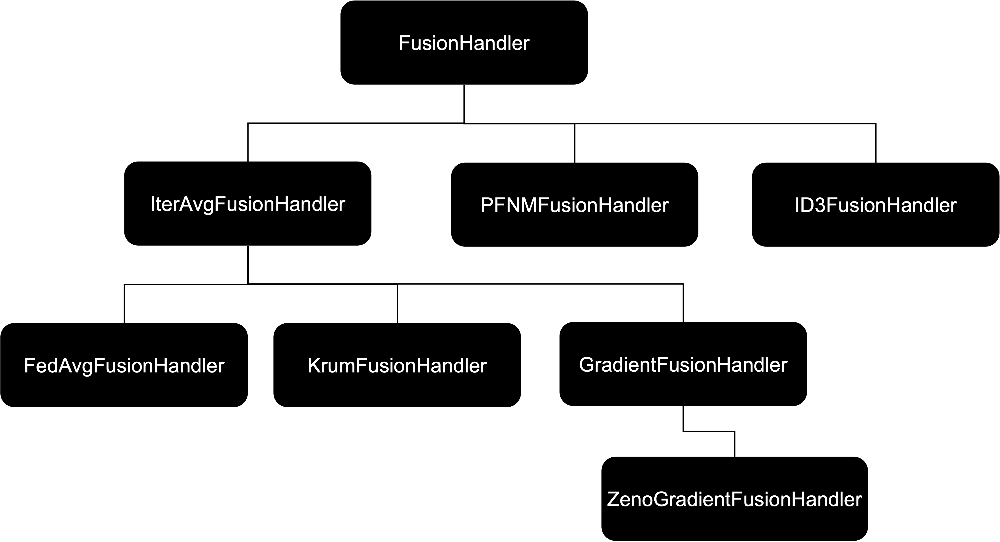
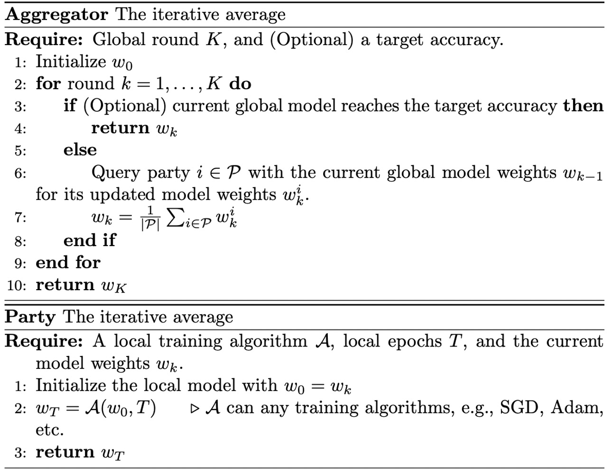

# How to add a new federated learning algorithm to IBM FL library?

Federated learning (FL) is an approach to perform collaborative learning. Therefore, an algorithm designed for FL usually contains two parts:

1. A fusion module, implemented as a fusion handler class in IBM FL, sits at the aggregator side to coordinate the FL training process. It is usually responsible for selecting participating parties, issuing queries to the parties, fusing the `ModelUpdate` sent by the parties, and updating the global model;

2. A local training module, implemented as a local training handler class in IBM FL, sits at the party side to invoke local training process, such as, updating and training the local model, and constructing a `ModelUpdate` object based on the current local model and/or local datasets maintained by the party.

We split this tutorial into two parts to cover these two modules. Note that any federated learning algorithm should be agnostic to the machine learning library that performs the local training at the party side. For example, the iterative average algorithm, which will be used as an illustrating example in this tutorial, can be applied to train neural networks implemented via TensorFlow/Keras, PyTorch, and also Scikit-learn linear models. As long as the algorithm specifies the content and format of the `ModelUpdate` exchanged between the aggregator and the parties, it should be (ML) framework independent.

## Part 1: adding a new fusion handler class to IBM FL library

Below is a diagram illustrating the structure of the `FusionHandler` class and its sub-classes, for more details please refer to [API docs](https://ibmfl-api-docs.res.ibm.com/ibmfl/aggregator.html).



`FusionHandler` is an abstract class that provides a list of the required methods for a fusion handler class in IBM FL. It also provides a list of methods that facilitate writing new fusion handler classes.  See [here](https://ibmfl-api-docs.res.ibm.com/ibmfl/aggregator.html#module-ibmfl.aggregator.fusion.fusion_handler) for more details about the base class.

**Implement the fusion module.** Federated learning training starts with the aggregator invoking the method named `start_global_training` inside a fusion handler class. Hence, inheriting from `FusionHandler`, a new fusion handler class needs to implement the main part of its fusion module inside `start_global_traning`.

### A glance at `IterAvgFusionHandler` - an illustrating example

We now use a simple federated learning algorithm called iterative averaging as an example to walk you through the process of implementing the fusion handler class.  



As we can see from the above pseudocode, this FL algorithm requires the aggregator to iteratively query all parties with the current global model weight vector for their updated local model weight vectors. Upon receiving all replies, it updates the global model weight vector as the result of the simple average of all received local model weight vectors.

Below is an example of implementing it in IBM FL library.

```python
import numpy as np

from ibmfl.aggregator.fusion.fusion_handler import FusionHandler
from ibmfl.model.model_update import ModelUpdate


class IterAvgFusionHandler(FusionHandler):
    """
    <class descrption for this fusion handler class>
    """
    def __init__(self, hyperparams,
                 protocol_handler,
                 data_handler=None,
                 fl_model=None,
                 **kwargs):
        super().__init__(hyperparams,protocol_handler, data_handler, fl_model, **kwargs)

        self.name = "Iterative-Weight-Average"
        self.params_global = hyperparams.get('global') or {}
        self.params_local = hyperparams.get('local') or None
        self.rounds = self.params_global.get('rounds') or 1
        self.curr_round = 0

        if fl_model and fl_model.is_fitted():
            model_update = fl_model.get_model_update()
        else:
            model_update = None

        self.current_model_weights = \
            model_update.get('weights') if model_update else None

    def start_global_training(self):
        """
     Starts global federated learning training process.
     """
        # algorithm starts
        while self.curr_round <= self.rounds:
            # construct ModelUpdate
            if self.current_model_weights:
                model_update = ModelUpdate(weights=self.current_model_weights)
            else:
                model_update = None

            # define the query content that the corresponding 
            # `LocalTrainingHandler` understands
            payload = {'hyperparams': {'local': self.params_local},
                       'model_update': model_update
                       }

            # query all parties 
            # and collect all model updates for aggregation:
            lst_model_updates = self.query_all_parties(payload)
            # perform the aggregation
            w = []

            for update in lst_model_updates:
                w.append(np.array(update.get('weights')))

            weights = np.mean(np.array(w), axis=0)

            # update the current global model weights
            self.current_model_weights = weights.tolist()

            # Update the global model if we are maintaining one
            if self.fl_model is not None:
                self.fl_model.update_model(
                    ModelUpdate(weights=self.current_model_weights))

            self.curr_round += 1
```

Inheriting from `FusionHandler` base class, this fusion handler class is initialized with hyperparameters and a protocol handler class, and both data handler and fl_model are _optional_ for this class. During initialization, it extracts global hyperparameters and a copy of the initial global model's weights if any.
Inside the `start_global_training` method, it implements a procedure to iteratively querying parties with the current global model's weights and updating the current global model's weights with the collected replies from parties.

Note that in this particular example, we only use a pre-defined maximum global round number `self.rounds` as the termination criteria. If a dataset is provided (via passing a `data_handler` object during initialization) and a global model is maintained (via passing `fl_model` object during initialization), the algorithm can also use global accuracy as the termination criteria. For simplicity, we skip the implementation of such functionality.

Moreover, the above algorithm queries all the registered parties (via `query_all_parties`). However, IBM FL also allows algorithms to query a subset of parties at each global training round, see [here](#helper-methods-to-send-queries-to-parties) for a full list of methods to send queries to parties.

### Access the global model

This is an optional step. In order to enable the functionality of sending the global model to all parties, one can add a `get_global_model` method in the fusion handler class that returns the current global model or the model parameters. Any federated learning task that uses this fusion handler can send the current global model to all parties via the `SYNC` command. See below for an example code.

```python
def get_global_model(self):
    return ModelUpdate(weights=self.current_model_weights)
```

### Helper methods to send queries to parties

The `FusionHandler` based class provides several helper methods to extract a list of parties and send queries to parties.

* `get_registered_parties`: Returns a list of parties that registered for the current federated learning task.
* `get_available_parties`: Returns a list of parties still available in the current federated learning task.
* `query_all_parties`: Sends a query to all registered parties, and returns a list of collected `ModelUpdate`.
* `query_parties`: Sends queries to the corresponding list of parties, and returns a list of collected `ModelUpdate`.

### An example of sending a query to all available parties

The following four steps assumes the fusion handler is inherited from the `FusionHandler` base class.

1. Construct a `ModelUpdate` to be sent to the parties. This is _optional_ if one does not use the `ModelUpdate` object to wrap the exchanged information between the aggregator and parties. However, we suggest our users to follow IBM FL conventional rules so that the new script works better together with other IBM FL modules.

2. Define a message content as a dictionary.
3. Obtain the list of available parties.
4. Send the query and collect replies.

```python
# An example using some attributes from the above `IterAvgFusionHandler` class.
# step 1
if self.current_model_weights:
    model_update = ModelUpdate(weights=self.current_model_weights)
else:
    model_update = None

# step 2 (you can put any content in the dictionary as you want, 
# as long as the local training module at the party side can parse it correctly.
# This `payload` dictionary will be passed to the `train` method of 
# the local training handler as `fit_param` argument, see Part 2 for more details about local training handler.)
payload = {'hyperparams': {'local': self.params_local}, 
           'model_update': model_update
           }
# step 3
lst_parties = self.get_available_parties()

# step 4
lst_replies = self.query_parties(payload, lst_parties)

```

## Part 2: adding a new local training handler class to IBM FL library

As a counterpart to the `FusionHandler` on the aggregator side, `LocalTrainingHandler` and its subclasses manage the training of local models and construct `ModelUpdate` that will be sent to the aggregator. The base class of `LocalTrainingHandler` is initialized with `FLModel`, `DataHandler` and `Hyperparams` (if any), see [API docs](https://ibmfl-api-docs.res.ibm.com/ibmfl/party.html#module-ibmfl.party.training.local_training_handler) for more details.

### A glance at `LocalTrainingHandler` -   an illustrating example

As we can see from the pseudocode of iterative averaging algorithm, once the party receives the query from the aggregator (sent via `IterAvgFusionHandler`) this FL algorithm requires the party to update its own local model with the current global model weights and starts to train the local model based on its own local dataset for a certain number of epochs. It then prepares a reply message with the current local model weights and sends it to the aggregator.

Below is an example of implementing it in IBM FL library.

```python
import numpy as np

from ibmfl.party.training.local_training_handler import \
    LocalTrainingHandler


class IterAvgLocalTrainingHandler(LocalTrainingHandler):

    def __init__(self, fl_model,
                 data_handler,
                 hyperparams=None,
                 **kwargs):
        super().__init__(fl_model, data_handler, hyperparams, **kwargs)

    def train(self, fit_params=None):
        """
        Train locally using fl_model. At the end of training, a
        model_update with the new model information is generated and
        sent through the connection.
        """
        train_data, (_) = self.data_handler.get_data()

        self.update_model(fit_params.get('model_update'))

        self.fl_model.fit_model(train_data, fit_params, local_params=self.hyperparams)

        update = self.fl_model.get_model_update()

        return update
```

The `LocalTrainingHandler` base class and its subclasses handle the `TRAIN` request sent by the aggregator via a method named `train`. In the above example, the `train` method performs the following steps:

1. Extract the local training data via `DataHandler`.
2. Update the local model if any `model_update` is contained in the query message (message content will be loaded as `fit_param` and passed to `train` method) sent by the aggregator.
3. Invoke the local training by calling the `fit_model` method defined in a specific `FLModel` class.
4. Extract the model update from the local model via `get_model_update`.

Note that the above example `train` method is a simplified version of the `train` method in the base class, it may be general enough to work with several different FL algorithms. However, it is possible that some FL algorithms require the parties to include more information in their replies or perform a more complicated task than simply invoking the`fit_model` to perform local training. In this case, one can overwrite the `train` method by adding a new local training handler class inherited from the `LocalTrainingHandler` base class. For example, IBM FL supports a FL algorithm ([FedAvg](../../examples/fedavg)) that performs a weighted average of local model parameters, whose weights depend on the size of the local training dataset. Therefore, this local training handler overwrites the `train` method to include the number of training samples in its `ModelUpdate` so that the aggregator can decide on the appropriate weights to fuse the local model parameters.

Other than `TRAIN`, the `LocalTrainingHandler` base class also handles other commands like `EVAL`, `SAVE` and `SYNC` from the aggregator. A customized local training handler class can obtain these functionalities for free by inheriting from the base class.

## One last step

Now we have both modules implemented for the new FL algorithm. They are supposed to work together to train a Ml model in IBM FL. Let us start testing it in IBM FL, see [here](configure_fl.md) for how to configure a FL task and then run a FL training using our new FL algorithm!
