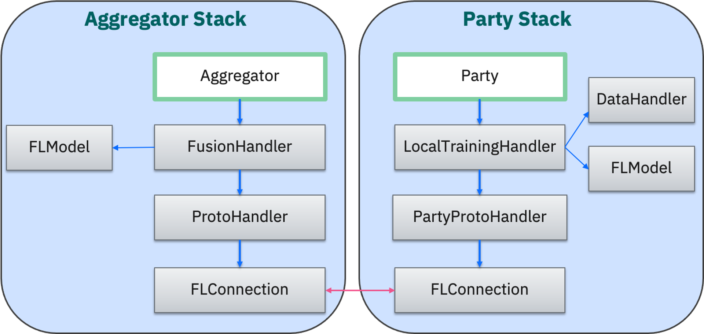

# Aggregator and Party Configuration

IBM federated learning offers as abstraction an *Aggregator* and *Parties* 
(as shown in the figure below) so that a group of parties can collaboratively learn 
a machine learning model (usually referred to as a *global model*) 
without revealing their raw data to each other. 
For most federated learning algorithms, 
only *model updates*, e.g., model weights, are shared with the aggregator. 
The aggregator then learns a global model by aggregating the information provided by parties. 
We now introduce these two abstractions in IBM FL.

- The *aggregator* is in charge of running the *Fusion Algorithm*. 
A fusion algorithm queries the registered parties to carry out the federated learning training process. 
The queries sent vary according to the model/algorithm type. 
In return, parties send their replies as a *model update* object, 
and these model updates are then aggregated according to the specified fusion algorithm, 
specified via a *Fusion Handler* class. 
- Each *party* holds its own dataset that is kept to itself and used to answer queries received from the aggregator. 
Because each party may have stored data in different formats, IBM FL offers an abstraction called *Data Handler*. 
This module allows for custom implementations to retrieve the data from each of the participating parties. 
A *Local Training Handler* sits at each party to control the local training happening at the party side.

The aggregator and parties communicate through flask-based servers. 
All messages and communication are handled by protocol handler and connection modules. 



IBM FL has built-in algorithms to train different types of machine learning models, 
e.g., neural networks, linear models and decision tree, in a federated learning fashion. 
Setting up a federated learning task in a real distributed environment is not an easy job. 
IBM FL is designed to allow different modules to be swapped in and out without interfering with the functionality of other components. 
Users can configure these components via configuration files (`.yml` files) for the aggregator and each party. 
The following is a list of building blocks that may appear in the configuration files.

* Connection: 
Connection types for communication between the aggregator and each registered party. 
It includes information needed to initiate the connection, in particular, 
flask server information, flask connection location, and 
a synchronization mode flag (`sync`) for training phase. 
* Data: Data preparation and pre-processing. 
It includes information needed to initiate a data handler class, in particular, 
a given data path, a data handler class name and location.
* Fusion: Fusion algorithm to be performed at the aggregator.
It includes information needed to initiate a fusion algorithm at the aggregator side, in particular,
a fusion handler class name and location.
* Local_training: Local training algorithm happened at the party side.
It includes information needed to initiate a local training handler at the party side, in particular,
 a local training handler class name and location.
* Hyperparams: It includes global training and local training hyperparameters.
* Model: Definition of the machine learning model to be trained.
It includes information needed to initiate a machine learning model and its corresponding functionality, 
like train, predict, evaluate and save, etc. 
It includes a model class name and location, and a given model specification path.
* Protocol_handler: Handling the protocol for message exchange. 
It includes information needed to initiate a protocol, in particular, 
a protocol handler class name and location.
* Aggregator: aggregator server information (only for the parties' configuration file).

We now provide an example of the configuration files to start training a convolutional neural network defined in Keras 
on the MNIST dataset in IBM FL. 
For sample code of how to generate these configuration files, one can refer to `examples/iter_avg` 
in our git repository.

## The aggregator's configuration file.

The following YAML file is an example of the aggregator's configuration file. 
In this example, we use flask as our connection type, and simple average fusion algorithm 
(select `IterAvgFusionHandler` in `fusion` section) to train the model.
Moreover, we set the global training round as 3 and each global training round triggers 
parties to perform 3 local training epochs.
We also use the default protocol for the aggregator.
Note that the aggregator does not specify a data file (`data` section) or maintain a global model (`model` section). 
Hence, during the federated learning process, it only keeps track of the current model parameters, 
i.e., current weights of the neural network. 
However, it is possible that the aggregator also has data for testing purposes and maintains a global model. 
When this is the case, one needs to add `data` and `model` sections in the configuration file. 
```yaml
connection:
  info: # ip and port to set up flask server
    ip: 127.0.0.1
    port: 5000
    tls_config: 
      enable: false # A flag to enable or disable tls authentication
  name: FlaskConnection
  path: ibmfl.connection.flask_connection
  sync: false # flag to indicate if the training query is synchronized or not
fusion:
  name: IterAvgFusionHandler
  path: ibmfl.aggregator.fusion.iter_avg_fusion_handler
hyperparams:
  global:
    max_timeout: 60 # maximum time aggregator will wait to receive parties' replies
    parties: 2 # number of register parties
    rounds: 3 # global training round
    termination_accuracy: 0.9 # target accuracy for the global model if a dataset is provided to the aggregator
  local:
    optimizer:
      lr: 0.01 # learning rate for local training
    training:
      epochs: 3 # local training epochs
protocol_handler:
  name: ProtoHandler
  path: ibmfl.aggregator.protohandler.proto_handler
```

## The party's configuration file.

The following YAML file is an example of the party's configuration file. 
In this example, a flask connection is selected, therefore, 
the aggregator server information will be provided in the `aggregator` section. 
The party also specifies its data information in the `data` section, 
and in the `model` section, the Keras model definition is given as an `.h5` file.
Moreover, for simple average fusion algorithm, please select `LocalTrainingHandler` in `local_training` section.
The default protocol is selected for parties' protocol.
```yaml
aggregator: # aggregator ip and port information for parties to receive queries
  ip: 127.0.0.1
  port: 5000
connection:
  info: # ip and port to set up flask server
    ip: 127.0.0.1
    port: 8085
    tls_config: 
      enable: false # A flag to enable or disable tls authentication
  name: FlaskConnection
  path: ibmfl.connection.flask_connection
  sync: false
data:
  info: # provides the data files' location
    npz_file: examples/data/mnist/random/data_party0.npz
  name: MnistKerasDataHandler # a data handler class to load the local data file
  path: ibmfl.util.data_handlers.mnist_keras_data_handler # path to the data handler class
local_training:
  name: LocalTrainingHandler
  path: ibmfl.party.training.local_training_handler
model:
  name: KerasFLModel # A Keras model is selected for training
  path: ibmfl.model.keras_fl_model
  spec:
    model_definition: examples/configs/iter_avg/keras/compiled_keras.h5 # path to the Keras model file
    model_name: keras-cnn # a customized model name
protocol_handler:
  name: PartyProtocolHandler
  path: ibmfl.party.party_protocol_handler
```

To run a federated learning experiment, 
one can follow our [step-by-step example](../../quickstart.md) to set up the IBM FL environment and start the aggregator and parties.
