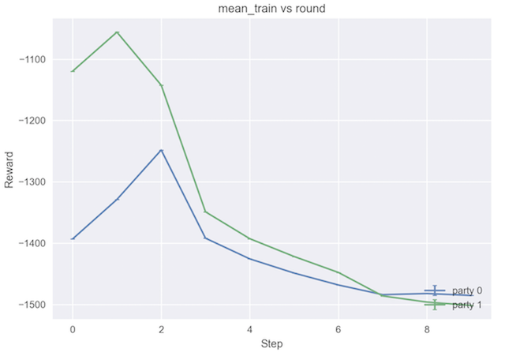

# IBMFL CLI Automator

Here you can find scripts which allow us to easily set up and run tests for IBMFL in an automated manner. It is possible to run a series of identical trials which vary in a parameterized way without any manual command entry or otherwise. The necessary additional libraries are contained in `test_requirements.txt`.


## Getting Started

There is a ready-to-run example for mnist in `ibmfl_cli_automator/examples/mnist`, alongwith all the supplemental files needed.

Trying out this example is as simple as running:
```
ibmfl_cli_automator/run.py ibmfl_cli_automator/examples/mnist
```

and this is the only parameter that the automator takes, namely, a path to the folder that contains the config files.

This will print some useful info to stdout to help you track your IBMFL run's progress, including the timestamp that is also used to uniquely identify each run you trigger. It will also write a metadata file on your local machine (inside `local_staging_dir` as specified in your config file) with further info. This metadata can be used to monitor your remote jobs with further detail, or kill them if something has gone wrong, e.g.:
```
ibmfl_cli_automator/monitor.py --config ${local_staging_dir}/latest/trial1/metadata.yml kill
```

If you realize you need to make a few changes to your code, you can easily sync your changes to your remote machines:
```
ibmfl_cli_automator/sync_repo.sh slaguna sylvester23.sl.cloud9.ibm.com . /data/slaguna/repos/IBMFL
```

It will use `rsync` to only send changed files, and will avoid sending any git, virtualenv, pycache, etc. folders that would cause problems.


## Automator Config Parameters

A description of this config file and the supplemental files, and some guidance on how to use them is as follows:

<p
    align="middle">
    
    <br>
    A sample config file
</p>


### `config_runner.yml`

This is the primary automator configuration file which references the others. Its main job is to specify how the *trials* (one execution of FL) will be structured. Many of the configurations here will be used as values for template parameters for the aggregator and party config files that will be generated as part of the testing framework's execution. Currently, the `${agg_ip}`, `${agg_port}`, `${party_ip}`, `${party_port}`, `${n_parties}`, and `${n_rounds}` are filled with the appropriate values from the config file, based on the machines and values specified for each _experiment_. An experiment is a set of identical trials that all use the same specification. The config file takes in a list of experiments that are executed one-by-one.

The machines used for each experiment are specified using the `agg_machine` (value) and `party_machines` (list) keys in the `config_runner.yml` file. The machines are specified by their key, which can be used to obtain the machine's details from the `machines` dictionary also present in the config file. The keys that can be specified per machine are as follows:

key               | description
---------------   | -----------
`ssh_username`    | your username on the machine, used for SSHing
`ip_address`      | IP address of machine, used for IBMFL connection and for SSHing
`port_number`     | port to use for IBMFL connection
`staging_dir`     | absolute path to where relevant input files will be staged, and where relevant output files will be written to
`ibmfl_dir`       | absolute path to where the IBMFL checkout is on the machine
`venv_dir`        | relative path to `ibmfl_dir` where the virtual environment for IBMFL is located
`venv_uses_conda` | boolean value for whether the machine's virtual environment is Conda-based or not

There are additional experiment config values that can be specified:

key                      | description
------------------------ | -----------
`local_staging_dir`      | where to stage all supplementary files (data, etc) for the experiment, and where to store any output on the local machine (i.e. the machine where the automator is called)
`local_ibmfl_dir`        | absolute path to IBMFL repository on local machine (currently unused)
`n_parties`              | number of parties to use; can be less-than or equal-to the number in the `party_machines` list; filled into the aggregator config
`n_rounds`               | number of rounds to train for; filled directly into the aggregator config
`party_machines`         | list of machines as keys in the `machines` dictionary, to use for this experiment
`shuffle_party_machines` | boolean; if True, the order of the machines in the `party_machines` list will be randomized, and `len(party_machines)` must be less-than or equal-to `n_parties`; otherwise, the first `n_parties` will be used, or if `n_parties` is larger than `len(party_machines)`, it will repeat machines in order from the beginning once it reaches the end
`n_trials`               | how many IBMFL runs to do with this config


### `config_agg_tmpl.yml` and `config_party_tmpl.yml`

These are templates for the aggregator and party configuration files. When the automator is triggered, it will fill in these template parameters with values from the automator config file. The template parameter values should be pretty self-explanatory with respect to how they are filled based on the automator config. In the future, it will be possible to easily specify your own pairs of values to fill programmatically from the automator config to the agg and party configs, so you can parameterize your experiments in any way you'd like.


## Additional Scripts

There are some additional scripts that can (hopefully) make development and testing of IBMFL or of an IBMFL-based project less tedious.


### `monitor.py`

The monitor script takes a config file by named argument `--config` and an action: `daemonize`, `list`, or `kill`. The config is the metadata written automatically by the `config_runner` script. Or, if you want, you can write your own config, which will let you view all FL-related processes on a list of machines: see `ibmfl_cli_automator/examples/metadata_global.yml` for an example. The action can be one of the following:

action      | description
----------- | -----------
`daemonize` | use SSH persistence to make subsequent calls nearly instantaneous
`list`      | list all FL-related jobs associated with a given run, or all for listed machines (in global case)
`kill`      | terminate all _processes_ associated with a given run, or on the listed machines (in global case); also lists child processes of the IBMFL scripts, to show you how many processes were truly killed

This can come in handy when debugging and you want to ensure no straggling processes are open on some remote machines you are using. It avoids having to manually SSH into and terminate those processes, which can be very tedious for runs with many parties.


### `sync_repo.sh`

This simple script takes 4 parameters in the following order: `username`, `address`, `local_dir`, and `remote_dir`, and syncs your local directory with the remote directory. Before using, __double-check that your virtual environment directory is excluded by the rsync command__ as syncing your virtual environment folders can corrupt the remote machine's virtual environment! It should ideally use the config files to automate syncing all relevant machines in the automator config file, but this preliminary version is provided for convenience anyway.


## Metrics and Post-Processing

It is possible to customize the metrics collection process.

The party's config file can contain a `metrics` secition which lets you load a custom metrics class and options that are passed to it, in addition to a path where the metrics will be logged. By providing your own implementations of the `*_train_hook` functions inside that class, you can inject code at various points in the training and testing processes in order to record information from them for outputting later. By deriving from the existing `MetricsRecorder` class, only these functions need to be overridden. While not necessary, if you customize the model class as well, there are few limitations to what metrics you collect and how.

Metrics are logged every round. The metrics can be observed while the run is taking place and used as real-time feedback to the user as to the run's progress.

The automator's config contains a few options to let you configure how the metrics are used during post-processing on a per-experiment basis. The `postproc_fn` key lets you specify a function to run on the metrics collected from that experiment, and the `postproc_x_key` and `postproc_y_keys` let you configure the way that plots are generated. The signature that should be used for custom post-processing functions is written below:

```
def postprocess(metrics_file_tmpl, n_trials, n_parties, y_keys)
```

The `metrics_file_tmpl` should be parameterized by trial and by party (put `${trial}` where the trial number should be filled in and `${id}` where the party ID should be filled in), so that the full path can be generated for each trial that was run. If using the testing framework, this path will be generated for you.

There are existing functions for generating some standard plots and also some helper functions for performing common operations for post-processing the data collected from the runs.


### Plot-generating Functions

These can be specified directly in the automator config.

#### `gen_reward_vs_time_plots`
Produces plots of the progress of metrics provided in the `reward_keys` parameter (corresponding to the more generic `postproc_y_keys` above) versus either the round number or time (where a key for the timing parameter to be used must be specified as an optional parameter).

As we had specified this function in the config above, the following plots get generated, during post-processing.

<p
    align="middle">
    
    
    
</p>

#### `gen_timing_plots`
Produces stacked bar charts of the average per-round timing basedon a list of keys providing timestamps at specific points during each round. By providing a set of timestamps that happen sequentially during a round, we can generate the duration of each period between these timesteamps and compute averages over the rounds for a given trial as well as over the same party for multiple trials if multiple trials were run. This is good for profiling the relative time taken during different sections of the round and to understand the reasons for the overall runtime observed for the runs.


### Helper Functions

#### `parse_party_data`
This function serves as an example of how to read in the data from a metrics file. TODO: generalize this so it doesn't rely on the specific keys present in `MetricsRecorder`. The data is read into Pandas tables and separated into `Series` for each metric. Every such `Series` for each party is stored in a list in an outer dictionary indexed by metric.

#### `group_by_iter`
Because we collect one file per trial, data for each trial is initially stored separately. It is inconvenient to operate on the data for each trial when stored in this way, because normally we will want to aggregate the values over the trials (see the next section for more on this). This reorganizes the data so that each inner list contains each trials' value per round, so that subsequent aggregation steps are simpler and cleaner to perform.

#### `aggregate_over_trials`
In many cases, experiments will run multiple trials to produce confidence bounds on data that we want to measure. This helper function takes a dictionary as returned by `group_by_iter`, and aggregates over the trials (i.e. compresses the data so that analogous datapoints for individual trials are reduced to a single datapoint) using each of the functions provided. The functions are to be passed in a dictionary with a key that will serve as a label for storing the output in the same, passed-in dictionary. The functions on the dictionary should take a single argument of a list of floating-point values, and return a single floating-point value. For an example of this, please see line 266-271 of `postprocess.py`.

#### `offset_vals` and `offset_vals_cycle`
These functions operate on the data coming straight out of `parse_party_data`. The first will offset each metric specified in `offset_keys` using each function in `offset_methods_dict`, which uses a dictionary just as in `aggregate_over_trials` to specify the functions used. In this case, the functions take a list and return another list, and transform the list using other values in the list in some way. Obvious, useful operations can be found on line 96 and line 102 of `postprocess.py`, which offset each value in the list by the first value and by the previous value, respectively. This is useful for making all timestamps reference a certain point in time, or for computing durations from timestamps. The second function, `offset_vals_cycle`, does the same thing except instead of individually operating on `offset_keys` it treats them as a sequential set of timestamps for computing durations; this is what is used in `gen_timing_plots` to produce the intra-round durations.
