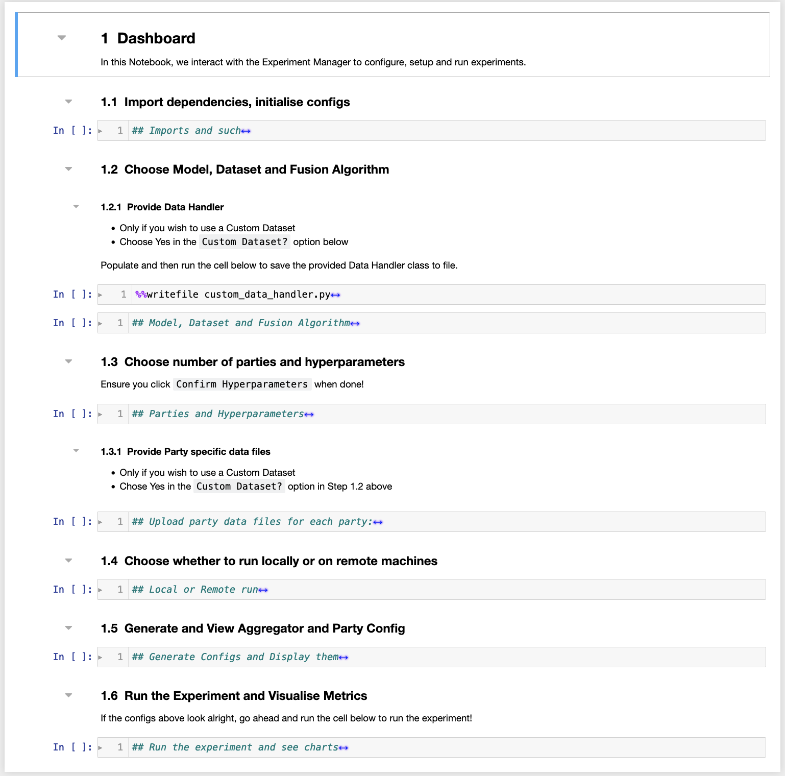
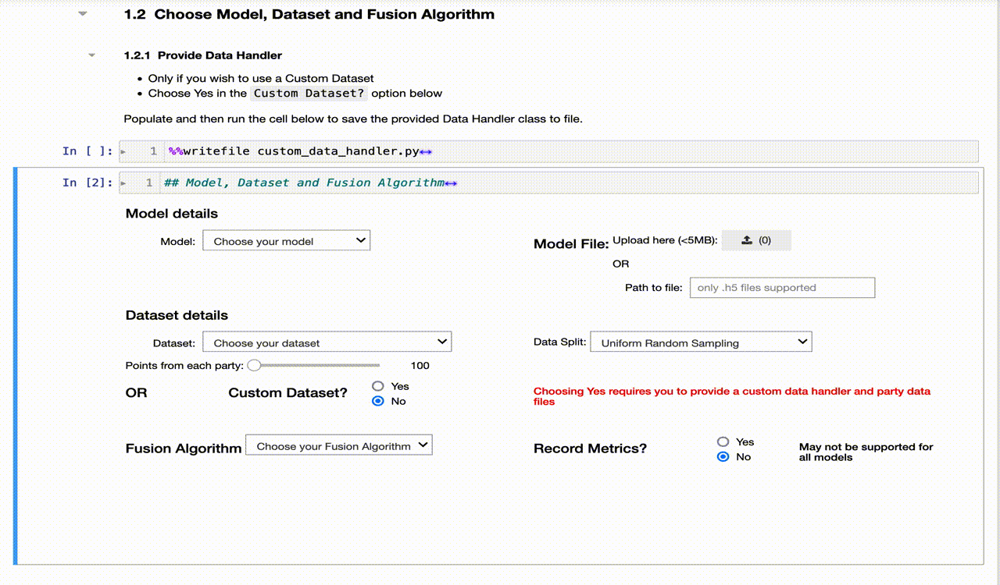
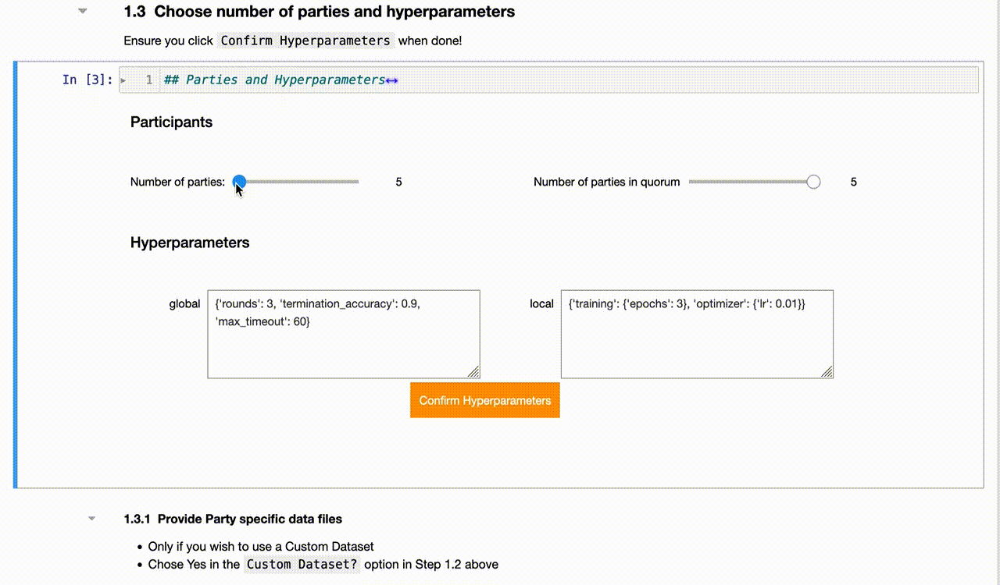
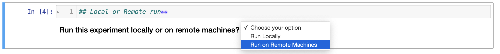
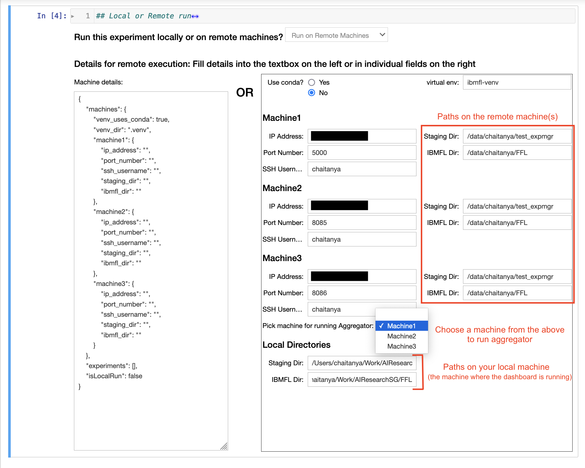
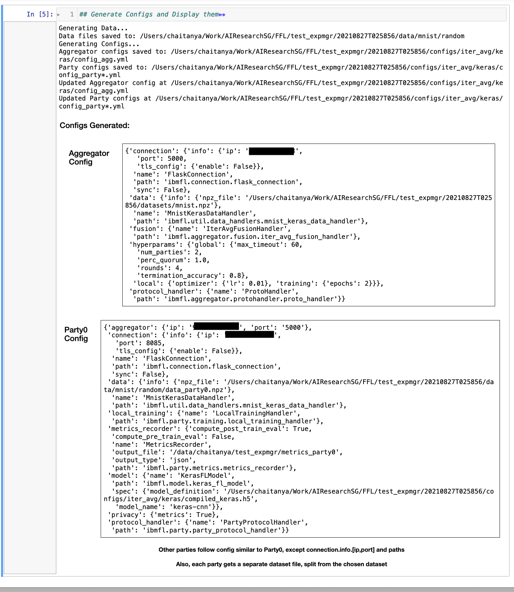
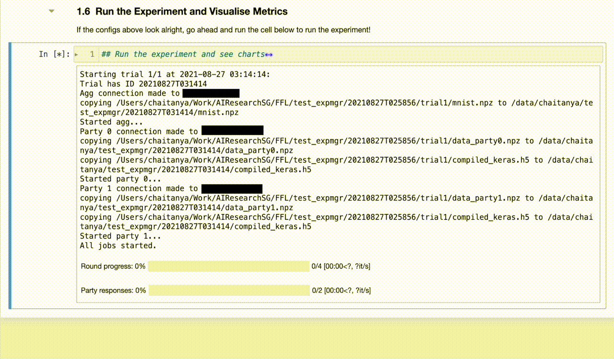
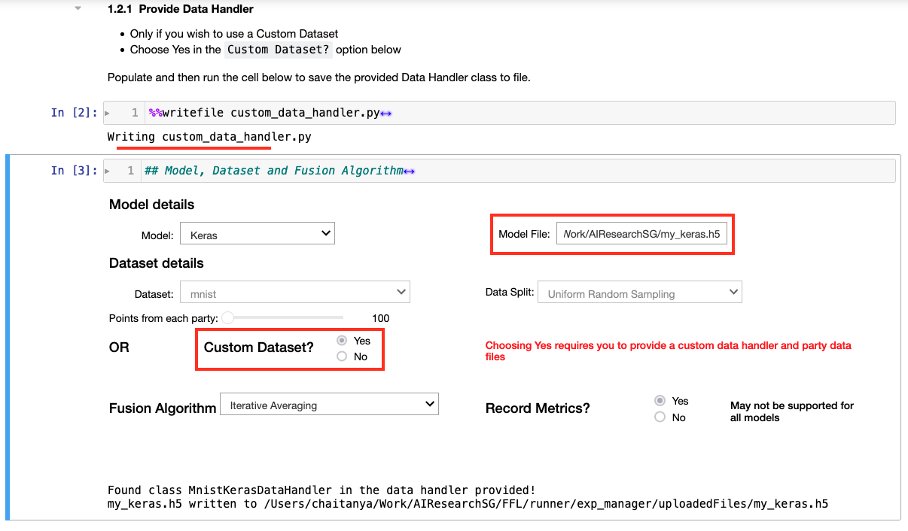
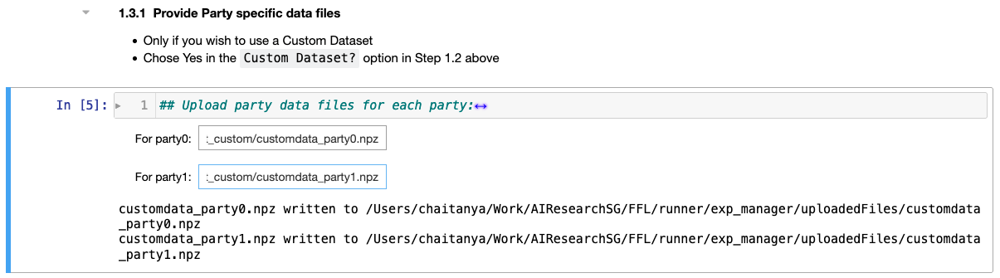

# Experiment Manager Dashboard
Jupyter Notebook frontend for setting up, launching, monitoring,  and evaluating the results of Federated Learning experiments.

## Usage Instructions:
This section enumerates the steps to be followed for a typical run of the FL experiment, using the `Keras` model, with the `MNIST` dataset and `Iterative Averaging` as the fusion algorithm. 

Please go over the _Using Custom Datasets/Models_ section at the bottom of the page, if you plan on using a custom dataset and/or custom model.

#### Step 1a: Run the notebook
Follow the instructions in the README.md file to get the notebook up and running in your browser.

The dashboard is split into multiple sections, each of which carries out various steps for running a federated learning experiment, using IBMFL. With the widgets and folding extensions installed, the dashboard should look like the following:

<i>Fig. 1: Experiment Manager Dashboard</i>

#### Step 1b: Setup imports and objects
Run the cell under section 1.1 in the notebook, so the necessary modules are imported and the `DashboardUI` class object is initialised into the kernel.
#### Step 2: Choose the model, pre-populated dataset and fusion algorithm
IBMFL supports a variety of models including _Keras_, _PyTorch_, _Scikit-learn_ and _TensorFlow_. You can choose your preferred model via the dropdown as shown in the figure below. Choosing the model populates the dataset and fusion algorithm dropdowns to display only those that are compatible (as far as the built-in examples go). 

<i>Fig. 2: Choosing the model, pre-populated dataset and fusion algorithm</i>

You could choose to record metrics, by clicking `Yes` for `Record Metrics?`. Note that this isn't supported for all models and so the option is greyed out when not available.

The dashboard also supports custom model files and datasets. The `Model File` and `Custom Dataset?` widgets shown in Fig. 2 facilitate the same, respectively. If you plan to use your own dataset files (instead of those listed in the dropdown), and/or your own model files (only `.h5` and `.pt` files are supported for now), please refer to the Using Custom Datasets/Models section below.

#### Step 3: Select number of participating parties and hyperparameters
Next, choose the number of parties you’d like to have in the experiment, using the slider on the left. Additionally, you could use the slider on the right to choose the number of parties the aggregator will wait on (the *quorum*), when collecting responses. If left untouched, this will be equal to the number of parties chosen in the slider on the left.

<i>Fig. 3: Choosing the number of parties</i>

Then you may review and modify (if needed) the hyperparameters corresponding to the choices made so far.

Finally, click on `Confirm Hyperparameters` to save the hyperparameters displayed.

The cell under section 1.3.1 is only required to be run in case you chose to use your own dataset. Please refer to the Using custom dataset/model section for more details.

#### Step 4: Run locally or on remote machines
Next, choose whether the experiment should be run *locally*, i.e., on the same machine as the dashboard; or *remotely*, i.e., across one or more remote virtual machines. 

<i>Fig. 4: Run the experiment locally or on remote machines</i>

##### Local Run:
In case you choose the `Run Locally` option...
##### Remote Run:
If the `Run on Remote Machines` option, as it needs more details compared to the local run.

For the remote run, the dashboard needs `IP address`, `port number`, `SSH username`, the `IBMFL Dir` (IBMFL project root directory) and a `Staging Dir` (a staging directory where all configuration files, dataset files and logs should go) &#8722; for each of the machines. Prior to filling this in, check the appropriate option depending on whether the machines use `conda`, as well as the corresponding virtual environment path.

<i>Fig. 5: Run the experiment locally or on remote machines</i>

In the dropdown labelled `Pick machine for running Aggregator:`, select the machine where the Aggregator should be run. Finally, in the `Local Directories` section, add in the directories for the local `Staging Dir` and local `IBMFL Dir`. These should exist on the same machine where the dashboard Notebook is being run.

All this information can be keyed in either through the fields on the right or via a JSON as shown on the left.

#### Step 5: View Aggregator and Party configs
On executing the cell under section 1.5, the `generate_data.py` and `generate_configs.py` scripts are invoked and the resulting aggregator and party0 files are displayed, as shown here.

<i>Fig. 6: Aggregator and Party0 configs</i>

If the configs look alright, execute the next cell under section 1.6 to get things running and monitor progress.

#### Step 6: Monitor experiment and visualise results
Once the experiment begins running, details about each of the connections are printed with progress bars indicating near real-time progress made in terms of the number of rounds completed from the total as well as the number of party responses in each round.

<i>Fig. 7: Monitoring progress during the experiment</i>

Once the experiment completes successfully, both the bars would be green and if post-processing of metrics is supported, a button labelled `Show Charts` will be visible.

On clicking the button, you'll see loss and accuracy line plots for each party.

**Note:**

The dashboard leverages [`tqdm`](https://github.com/tqdm/tqdm) to display progress bars for indicating real-time progress of FL jobs. While this works fine for most ML models that the dashboard supports, it doesn't work well with `sklearn` models. 

If you notice the progress bar(s) stuck on some value or only one of them changing, let the experiment continue and check the logs for errors. For the prepopulated datasets and built-in algorithms, there were no errors in the logs, despite the progress bars being stuck. This could be on account of timing delays between FL processes and progress bar updates and might be addressed in a subsequent release.

---

## Using Custom Datasets/Models

The instructions below highlight the key things to note while following the above steps when using your own custom dataset and/or model files. 

Note that the supported model file formats are:
- [x] Keras HDF5 format (`.h5` file extension)
- [x] PyTorch models (`.pt` file extension)
- [x] Pickled models (`.pickle` file extension) for scikit-learn models
- [x] SavedModel directory (containing `assets/`, `saved_model.pb`, `variables/` files)

#### Before Step 2:
When bringing your own custom dataset, aside from the party specific files (`.npz` or `.csv`) you also need to provide a datahandler, in the cell under section 1.2.1. To get an idea of what is expected, you may refer the example `MnistKerasDataHandler` provided in the notebook in the cell under section 1.2.1. After you've pasted your datahandler in the cell, the magic command in the top line will save it as `custom_data_handler.py` to the file system when the cell is executed. Please make sure that while pasting the code for your datahandler, you do not overwrite the `%%writefile ...` command.

<i>Fig. 8: Provide datahandler, model path and choose to use a Custom Dataset</i>

Next, you may follow the instructions for Step 2 as given in the previous section, with the exception to choose:
- `Yes` for `Custom Dataset?` 
- Optionally, you may want to provide the path to your model file in the `Model File:` text box.

The next step wherein number of parties are chosen and the hyperparameters finalised, stays the same. 

#### Before Step 4:
The cell under section 1.3.1 is where you need to provide the absolute paths to the custom dataset files for each of the parties in the federated learning job. On executing the cell, you'll see as many textboxes as the number of parties. Please paste the absolute paths for the custom dataset files (`.npz` or `.csv`) in the respective textboxes. Ensure that the file extensions used comply with what the datahandler (provided in the cell under section 1.2.1) expects.

<i>Fig. 9: Provide party-specific custom dataset files</i>

The `uploadedFiles` folder is created by the dashboard for managing the various artifacts provided by the user.
You can check that the files you provided are indeed showing up in the `uploadedFiles` directory.

Once this is done, you may follow through the remaining steps&#8722; for choosing to run locally or on remote machines, generating config files and running the experiment&#8722; from the previous section itself.

---
---
