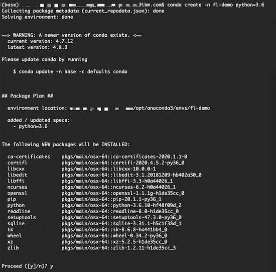

# Quickstart

## Try out the step-by-step Keras classifier example.
All commands are assumed to be run from the directory where the `.whl` file is located. 
We also assume other folders, like `examples`, are located under the same directory.
Use 
```commandline
cd <path_to_whl_directory>
```
to arrive at the correct directory.

In this example, we will train a Keras CNN model, as shown in figure below, on
[MNIST](https://en.wikipedia.org/wiki/MNIST_database) data in the federated learning fashion. 
```python
num_classes = 10
img_rows, img_cols = 28, 28
if K.image_data_format() == 'channels_first':
    input_shape = (1, img_rows, img_cols)
else:
    input_shape = (img_rows, img_cols, 1)

model = Sequential()
model.add(Conv2D(32, kernel_size=(3, 3),
                 activation='relu',
                 input_shape=input_shape))
model.add(Conv2D(64, (3, 3), activation='relu'))
model.add(MaxPooling2D(pool_size=(2, 2)))
model.add(Dropout(0.25))
model.add(Flatten())
model.add(Dense(128, activation='relu'))
model.add(Dropout(0.5))
model.add(Dense(num_classes, activation='softmax'))

model.compile(loss=keras.losses.categorical_crossentropy,
              optimizer=keras.optimizers.Adadelta(),
              metrics=['accuracy'])
```

### 1. Set up a running environment for IBM federated learning.

We highly recommend using Conda installation for IBM federated learning.
If you don't have Conda, you can install it [here](https://docs.conda.io/projects/conda/en/latest/user-guide/install/). 
If you already have Conda installed, create a new conda environment for IBM federated learning by running:
```commandline
conda create -n <env_name> python=3.6 tensorflow=1.15
```     
Follow the prompts to install all the required packages.
The figure below is a screenshot of sample outputs from setting up such a conda environment named *fl-demo*.



Run `conda activate <env_name>` to activate the new Conda environment, and install the IBM federated learning package by running:
```commandline
pip install <IBM_federated_learning_whl_file>
```  

**Note**: Lastest IBM FL library supports Keras model training with two different Tensorflow Backend versions (1.15 and 2.1). It is recommended to install IBM FL in different conda environment with different tf versions. See [here](setup.md#installation-with-conda-recommended) for details of how to set up IBM FL with a specific tensorflow backend.

### 2. Prepare datasets for each participating parties.

For example, run
```commandline
python examples/generate_data.py -n 2 -d mnist -pp 200 
```
This command would generate 2 parties with 200 data points each, randomly sampled from the MNIST dataset.
By default, the data is stored under the `examples/data/mnist/random` directory.
```buildoutcfg
Warning: test set and train set contain different labels
Party_ 0
nb_x_train:  (200, 28, 28) nb_x_test:  (5000, 28, 28)
* Label  0  samples:  22
* Label  1  samples:  30
* Label  2  samples:  16
* Label  3  samples:  22
* Label  4  samples:  17
* Label  5  samples:  25
* Label  6  samples:  12
* Label  7  samples:  15
* Label  8  samples:  19
* Label  9  samples:  22
Finished! :) Data saved in  examples/data/mnist/random
Party_ 1
nb_x_train:  (200, 28, 28) nb_x_test:  (5000, 28, 28)
* Label  0  samples:  22
* Label  1  samples:  18
* Label  2  samples:  22
* Label  3  samples:  23
* Label  4  samples:  14
* Label  5  samples:  23
* Label  6  samples:  22
* Label  7  samples:  20
* Label  8  samples:  18
* Label  9  samples:  18
Finished! :) Data saved in  examples/data/mnist/random
```
For a full description of the different options to prepare datasets, run `python examples/generate_data.py -h`.

### 3. Define model specification and create configuration files for the aggregator and parties.

For example, run:
```commandline
python examples/generate_configs.py -n <num_parties> -f iter_avg -m keras -d mnist -p <path>
```
This command performs two tasks:

1) It specifies the machine learning model to be trained, in this case, a Keras CNN classifier.  

2) It generates the configuration files necessary to train a `keras` model via fusion algorithm iter_avg, assuming `<num_parties>` parties join the federated learning training.
You must also specify the dataset name via `-d` and the party data path via `-p`. 

In this example, we run:
```commandline
python  examples/generate_configs.py -n 2 -f iter_avg -m keras -d mnist -p examples/data/mnist/random/
```
Hence, we generate 2 parties in our example, using the `mnist` dataset and `examples/data/mnist/random` as our data path.
```buildoutcfg
Finished generating config file for aggregator. Files can be found in:  <whl_directory>/examples/configs/iter_avg/keras/config_agg.yml
Finished generating config file for parties. Files can be found in:  <whl_directory>/examples/configs/iter_avg/keras/config_party*.yml
```
You may also see warning messages which are fine.
For a full description of the different options, run `python examples/generate_configs.py -h`.

Below you can see samples of configuration files.
- Aggregator's configuration file:
```yaml
connection:
  info:
    ip: 127.0.0.1
    port: 5000
    tls_config:
      enable: false
  name: FlaskConnection
  path: ibmfl.connection.flask_connection
  sync: false
data:
  info:
    npz_file: examples/datasets/mnist.npz
  name: MnistKerasDataHandler
  path: ibmfl.util.data_handlers.mnist_keras_data_handler
fusion:
  name: IterAvgFusionHandler
  path: ibmfl.aggregator.fusion.iter_avg_fusion_handler
hyperparams:
  global:
    max_timeout: 60
    parties: 2
    rounds: 3
    termination_accuracy: 0.9
  local:
    optimizer:
      lr: 0.01
    training:
      epochs: 3
protocol_handler:
  name: ProtoHandler
  path: ibmfl.aggregator.protohandler.proto_handler
```
- Party's configuration file:
```yaml
aggregator:
  ip: 127.0.0.1
  port: 5000
connection:
  info:
    ip: 127.0.0.1
    port: 8085
    tls_config:
      enable: false
  name: FlaskConnection
  path: ibmfl.connection.flask_connection
  sync: false
data:
  info:
    npz_file: examples/data/mnist/random/data_party0.npz
  name: MnistKerasDataHandler
  path: ibmfl.util.data_handlers.mnist_keras_data_handler
local_training:
  name: LocalTrainingHandler
  path: ibmfl.party.training.local_training_handler
model:
  name: KerasFLModel
  path: ibmfl.model.keras_fl_model
  spec:
    model_definition: examples/configs/iter_avg/keras/compiled_keras.h5
    model_name: keras-cnn
protocol_handler:
  name: PartyProtocolHandler
  path: ibmfl.party.party_protocol_handler
``` 
Notice that the configuration files contain a `data` section that is different for each party. In fact, each party's points to its own data, generated from the command in step 2.

### 4. Start the aggregator

To start the aggregator, open a terminal window running the IBM federated fearning environment set up beforehand,
and check that you are in the correct directory.  In the terminal run:
```commandline
python -m ibmfl.aggregator.aggregator examples/configs/iter_avg/keras/config_agg.yml
```
where the path provided is the aggregator configuration file path.
```buildoutcfg
2020-06-29 11:38:38,058 - ibmfl.util.config - INFO - Getting details from config file.
2020-06-29 11:38:45,001 - ibmfl.util.config - INFO - No model config provided for this setup.
2020-06-29 11:38:45,353 - ibmfl.util.config - INFO - No local training config provided for this setup.
2020-06-29 11:38:45,353 - ibmfl.connection.flask_connection - INFO - RestSender initialized
2020-06-29 11:38:45,353 - ibmfl.aggregator.protohandler.proto_handler - INFO - State: States.START
<ibmfl.connection.router_handler.Router object at 0x106cb9630>
2020-06-29 11:38:45,353 - ibmfl.connection.flask_connection - INFO - Receiver Initialized
2020-06-29 11:38:45,353 - ibmfl.connection.flask_connection - INFO - Initializing Flask application
2020-06-29 11:38:45,356 - __main__ - INFO - Aggregator initialization successful
```
Then in the terminal, type `START` and press enter.
```buildoutcfg
START
2020-06-29 11:39:24,349 - root - INFO - State: States.CLI_WAIT
2020-06-29 11:39:24,349 - __main__ - INFO - Aggregator start successful
 * Serving Flask app "ibmfl.connection.flask_connection" (lazy loading)
 * Environment: production
   WARNING: This is a development server. Do not use it in a production deployment.
   Use a production WSGI server instead.
 * Debug mode: off
2020-06-29 11:39:24,356 - werkzeug - INFO -  * Running on http://127.0.0.1:5000/ (Press CTRL+C to quit)
```

### 5. Start and register parties 

To start and register a new party, open one new terminal window for each party, running the IBM federated learning environment set up beforehand,
and make sure you are in the correct directory. In the terminal run:
```commandline
python -m ibmfl.party.party examples/configs/iter_avg/keras/config_party<idx>.yml
```
where the path provided is the path to the party's configuration file.

**NOTE**: Each party will have a different configuration file;
in our example, it is noted by changing `config_party<idx>.yml`.
For instance, to start the 1st party, one would run:
```commandline
python -m ibmfl.party.party examples/configs/iter_avg/keras/config_party0.yml
```
```buildoutcfg
2020-06-29 11:40:30,420 - ibmfl.util.config - INFO - Getting config from file
2020-06-29 11:40:30,420 - ibmfl.util.config - INFO - Getting details from config file.
2020-06-29 11:40:33,617 - ibmfl.util.config - INFO - No fusion config provided for this setup.
2020-06-29 11:40:33,987 - ibmfl.connection.flask_connection - INFO - RestSender initialized
<ibmfl.connection.router_handler.Router object at 0x135de64a8>
2020-06-29 11:40:33,997 - ibmfl.connection.flask_connection - INFO - Receiver Initialized
2020-06-29 11:40:33,997 - ibmfl.connection.flask_connection - INFO - Initializing Flask application
2020-06-29 11:40:34,000 - __main__ - INFO - Party initialization successful
```
You may also see warning messages which are fine.
In the terminal for each party, type `START` and press enter to start the party. 
Then type `REGISTER` and press enter to register the party for the federated learning task.
```buildoutcfg
START
2020-06-29 11:41:35,732 - __main__ - INFO - Party start successful
 * Serving Flask app "ibmfl.connection.flask_connection" (lazy loading)
 * Environment: production
   WARNING: This is a development server. Do not use it in a production deployment.
   Use a production WSGI server instead.
 * Debug mode: off
2020-06-29 11:41:35,735 - werkzeug - INFO -  * Running on http://127.0.0.1:8085/ (Press CTRL+C to quit)
REGISTER
2020-06-29 11:41:47,056 - __main__ - INFO - Registering party...
2020-06-29 11:41:47,071 - __main__ - INFO - Registration Successful
```
The aggregator terminal will also prompt out INFO to show that it receives the party's registration message (as shown in the third figure on the right).
```buildoutcfg
2020-06-29 11:41:47,067 - ibmfl.connection.flask_connection - INFO - Request received for path :6
2020-06-29 11:41:47,068 - ibmfl.aggregator.protohandler.proto_handler - INFO - Adding party with id 78da36fb-2443-45d0-80d2-b438bf8c01a5
2020-06-29 11:41:47,069 - werkzeug - INFO - 127.0.0.1 - - [29/Jun/2020 11:41:47] "POST /6 HTTP/1.1" 200 -
```

### 6. Initiate training from the aggregator
To initiate federated training, type `TRAIN` in your aggregator terminal and press enter.
**NOTE**: In this example, we have 2 parties join the training and we run 3 global rounds, each round with 3 local epochs.

Outputs in the aggregator terminal after running the above command will look like:
```buildoutcfg
TRAIN
2020-06-29 11:43:43,982 - root - INFO - State: States.PROC_TRAIN
2020-06-29 11:43:43,982 - __main__ - INFO - Initiating Global Training.
2020-06-29 11:43:43,982 - ibmfl.aggregator.fusion.fusion_handler - INFO - Warm start disabled.
2020-06-29 11:43:43,982 - ibmfl.aggregator.fusion.iter_avg_fusion_handler - INFO - Model updateNone
2020-06-29 11:43:43,983 - ibmfl.aggregator.protohandler.proto_handler - INFO - State: States.SND_REQ
2020-06-29 11:43:44,090 - ibmfl.aggregator.protohandler.proto_handler - INFO - Total number of success responses :2
2020-06-29 11:43:44,090 - ibmfl.aggregator.protohandler.proto_handler - INFO - State: States.QUORUM_WAIT
2020-06-29 11:43:44,090 - ibmfl.aggregator.protohandler.proto_handler - INFO - Target Qorum: 2
2020-06-29 11:43:47,423 - ibmfl.connection.flask_connection - INFO - Request received for path :7
2020-06-29 11:43:47,429 - ibmfl.connection.flask_connection - INFO - Request received for path :7
2020-06-29 11:43:47,480 - werkzeug - INFO - 127.0.0.1 - - [29/Jun/2020 11:43:47] "POST /7 HTTP/1.1" 200 -
2020-06-29 11:43:47,518 - werkzeug - INFO - 127.0.0.1 - - [29/Jun/2020 11:43:47] "POST /7 HTTP/1.1" 200 -
2020-06-29 11:43:49,094 - ibmfl.aggregator.protohandler.proto_handler - INFO - Timeout:60 Time spent:5
2020-06-29 11:43:49,094 - ibmfl.aggregator.protohandler.proto_handler - INFO - Target Qorum: 2
2020-06-29 11:43:49,094 - ibmfl.aggregator.protohandler.proto_handler - INFO - State: States.PROC_RSP
2020-06-29 11:43:49,108 - ibmfl.aggregator.fusion.iter_avg_fusion_handler - INFO - Model update<ibmfl.model.model_update.ModelUpdate object at 0x111835828>
2020-06-29 11:43:49,108 - ibmfl.aggregator.protohandler.proto_handler - INFO - State: States.SND_REQ
2020-06-29 11:43:49,318 - ibmfl.aggregator.protohandler.proto_handler - INFO - Total number of success responses :2
2020-06-29 11:43:49,318 - ibmfl.aggregator.protohandler.proto_handler - INFO - State: States.QUORUM_WAIT
2020-06-29 11:43:49,318 - ibmfl.aggregator.protohandler.proto_handler - INFO - Target Qorum: 2
2020-06-29 11:43:51,096 - ibmfl.connection.flask_connection - INFO - Request received for path :7
2020-06-29 11:43:51,131 - werkzeug - INFO - 127.0.0.1 - - [29/Jun/2020 11:43:51] "POST /7 HTTP/1.1" 200 -
2020-06-29 11:43:51,133 - ibmfl.connection.flask_connection - INFO - Request received for path :7
2020-06-29 11:43:51,176 - werkzeug - INFO - 127.0.0.1 - - [29/Jun/2020 11:43:51] "POST /7 HTTP/1.1" 200 -
2020-06-29 11:43:54,321 - ibmfl.aggregator.protohandler.proto_handler - INFO - Timeout:60 Time spent:5
2020-06-29 11:43:54,321 - ibmfl.aggregator.protohandler.proto_handler - INFO - Target Qorum: 2
2020-06-29 11:43:54,321 - ibmfl.aggregator.protohandler.proto_handler - INFO - State: States.PROC_RSP
2020-06-29 11:43:54,341 - ibmfl.aggregator.fusion.iter_avg_fusion_handler - INFO - Model update<ibmfl.model.model_update.ModelUpdate object at 0x120ceb128>
2020-06-29 11:43:54,341 - ibmfl.aggregator.protohandler.proto_handler - INFO - State: States.SND_REQ
2020-06-29 11:43:54,550 - ibmfl.aggregator.protohandler.proto_handler - INFO - Total number of success responses :2
2020-06-29 11:43:54,550 - ibmfl.aggregator.protohandler.proto_handler - INFO - State: States.QUORUM_WAIT
2020-06-29 11:43:54,550 - ibmfl.aggregator.protohandler.proto_handler - INFO - Target Qorum: 2
2020-06-29 11:43:56,553 - ibmfl.connection.flask_connection - INFO - Request received for path :7
2020-06-29 11:43:56,583 - werkzeug - INFO - 127.0.0.1 - - [29/Jun/2020 11:43:56] "POST /7 HTTP/1.1" 200 -
2020-06-29 11:43:56,584 - ibmfl.connection.flask_connection - INFO - Request received for path :7
2020-06-29 11:43:56,615 - werkzeug - INFO - 127.0.0.1 - - [29/Jun/2020 11:43:56] "POST /7 HTTP/1.1" 200 -
2020-06-29 11:43:59,553 - ibmfl.aggregator.protohandler.proto_handler - INFO - Timeout:60 Time spent:5
2020-06-29 11:43:59,553 - ibmfl.aggregator.protohandler.proto_handler - INFO - Target Qorum: 2
2020-06-29 11:43:59,553 - ibmfl.aggregator.protohandler.proto_handler - INFO - State: States.PROC_RSP
2020-06-29 11:43:59,571 - ibmfl.aggregator.fusion.iter_avg_fusion_handler - INFO - Reached maximum global rounds. Finish training :) 
2020-06-29 11:43:59,572 - __main__ - INFO - Finished Global Training
```
Outputs in party's (party 1) terminal after running the above command will look like:
```buildoutcfg
2020-06-29 11:43:43,998 - ibmfl.connection.flask_connection - INFO - Request received for path :7
2020-06-29 11:43:43,999 - ibmfl.party.party_protocol_handler - INFO - received a async request
2020-06-29 11:43:43,999 - ibmfl.party.party_protocol_handler - INFO - finished async request
2020-06-29 11:43:44,000 - werkzeug - INFO - 127.0.0.1 - - [29/Jun/2020 11:43:44] "POST /7 HTTP/1.1" 200 -
2020-06-29 11:43:44,000 - ibmfl.party.party_protocol_handler - INFO - Handling async request in a separate thread
2020-06-29 11:43:44,001 - ibmfl.party.party_protocol_handler - INFO - Received request from aggregator
2020-06-29 11:43:44,001 - ibmfl.party.party_protocol_handler - INFO - Received request in with message_type:  7
2020-06-29 11:43:44,001 - ibmfl.party.party_protocol_handler - INFO - Received request in PH 7
2020-06-29 11:43:44,001 - ibmfl.util.data_handlers.mnist_keras_data_handler - INFO - Loaded training data from examples/data/mnist/random/data_party0.npz
x_train shape: (200, 28, 28, 1)
200 train samples
5000 test samples
2020-06-29 11:43:44,052 - ibmfl.party.training.local_training_handler - INFO - No model update was provided.
2020-06-29 11:43:44,053 - ibmfl.party.training.local_training_handler - INFO - Local training started...
2020-06-29 11:43:44,053 - ibmfl.model.keras_fl_model - INFO - Using default hyperparameters:  batch_size:128
2020-06-29 11:43:44,080 - tensorflow - WARNING - From /Users/yi.zhou@ibm.com/opt/anaconda3/envs/ibmfl/lib/python3.6/site-packages/tensorflow/python/ops/math_ops.py:3066: to_int32 (from tensorflow.python.ops.math_ops) is deprecated and will be removed in a future version.
Instructions for updating:
Use tf.cast instead.
Epoch 1/3
200/200 [==============================] - 1s 5ms/step - loss: 2.2764 - acc: 0.1150
Epoch 2/3
200/200 [==============================] - 1s 4ms/step - loss: 2.0754 - acc: 0.2400
Epoch 3/3
200/200 [==============================] - 1s 6ms/step - loss: 1.7741 - acc: 0.4000
2020-06-29 11:43:47,353 - ibmfl.party.training.local_training_handler - INFO - Local training done, generating model update...
2020-06-29 11:43:47,359 - ibmfl.party.party_protocol_handler - INFO - successfully finished async request
2020-06-29 11:43:49,200 - ibmfl.connection.flask_connection - INFO - Request received for path :7
2020-06-29 11:43:49,236 - ibmfl.party.party_protocol_handler - INFO - received a async request
2020-06-29 11:43:49,236 - ibmfl.party.party_protocol_handler - INFO - finished async request
2020-06-29 11:43:49,237 - werkzeug - INFO - 127.0.0.1 - - [29/Jun/2020 11:43:49] "POST /7 HTTP/1.1" 200 -
2020-06-29 11:43:49,238 - ibmfl.party.party_protocol_handler - INFO - Handling async request in a separate thread
2020-06-29 11:43:49,238 - ibmfl.party.party_protocol_handler - INFO - Received request from aggregator
2020-06-29 11:43:49,238 - ibmfl.party.party_protocol_handler - INFO - Received request in with message_type:  7
2020-06-29 11:43:49,238 - ibmfl.party.party_protocol_handler - INFO - Received request in PH 7
2020-06-29 11:43:49,238 - ibmfl.util.data_handlers.mnist_keras_data_handler - INFO - Loaded training data from examples/data/mnist/random/data_party0.npz
x_train shape: (200, 28, 28, 1)
200 train samples
5000 test samples
2020-06-29 11:43:49,277 - ibmfl.party.training.local_training_handler - INFO - Local model updated.
2020-06-29 11:43:49,277 - ibmfl.party.training.local_training_handler - INFO - Local training started...
2020-06-29 11:43:49,277 - ibmfl.model.keras_fl_model - INFO - Using default hyperparameters:  batch_size:128
Epoch 1/3
200/200 [==============================] - 1s 4ms/step - loss: 1.4924 - acc: 0.6300
Epoch 2/3
200/200 [==============================] - 1s 3ms/step - loss: 1.8330 - acc: 0.4100
Epoch 3/3
200/200 [==============================] - 0s 2ms/step - loss: 1.0651 - acc: 0.6800
2020-06-29 11:43:51,074 - ibmfl.party.training.local_training_handler - INFO - Local training done, generating model update...
2020-06-29 11:43:51,078 - ibmfl.party.party_protocol_handler - INFO - successfully finished async request
2020-06-29 11:43:54,418 - ibmfl.connection.flask_connection - INFO - Request received for path :7
2020-06-29 11:43:54,455 - ibmfl.party.party_protocol_handler - INFO - received a async request
2020-06-29 11:43:54,456 - ibmfl.party.party_protocol_handler - INFO - finished async request
2020-06-29 11:43:54,458 - werkzeug - INFO - 127.0.0.1 - - [29/Jun/2020 11:43:54] "POST /7 HTTP/1.1" 200 -
2020-06-29 11:43:54,459 - ibmfl.party.party_protocol_handler - INFO - Handling async request in a separate thread
2020-06-29 11:43:54,459 - ibmfl.party.party_protocol_handler - INFO - Received request from aggregator
2020-06-29 11:43:54,459 - ibmfl.party.party_protocol_handler - INFO - Received request in with message_type:  7
2020-06-29 11:43:54,459 - ibmfl.party.party_protocol_handler - INFO - Received request in PH 7
2020-06-29 11:43:54,459 - ibmfl.util.data_handlers.mnist_keras_data_handler - INFO - Loaded training data from examples/data/mnist/random/data_party0.npz
x_train shape: (200, 28, 28, 1)
200 train samples
5000 test samples
2020-06-29 11:43:54,502 - ibmfl.party.training.local_training_handler - INFO - Local model updated.
2020-06-29 11:43:54,502 - ibmfl.party.training.local_training_handler - INFO - Local training started...
2020-06-29 11:43:54,502 - ibmfl.model.keras_fl_model - INFO - Using default hyperparameters:  batch_size:128
Epoch 1/3
200/200 [==============================] - 0s 2ms/step - loss: 0.9385 - acc: 0.7250
Epoch 2/3
200/200 [==============================] - 1s 4ms/step - loss: 1.0080 - acc: 0.7200
Epoch 3/3
200/200 [==============================] - 1s 4ms/step - loss: 0.7465 - acc: 0.7950
2020-06-29 11:43:56,514 - ibmfl.party.training.local_training_handler - INFO - Local training done, generating model update...
2020-06-29 11:43:56,518 - ibmfl.party.party_protocol_handler - INFO - successfully finished async request
```
Outputs from party 2 will be similar as party 1.

### 7. (Optional) Issue various commands to train again, evaluate, sync and save the models. 
For a full list of supported commands, see `examples/README.md`.
Sample outputs of issuing the `EVAL` command in one of the parties' terminal after the global training.
```buildoutcfg
EVAL
2020-06-29 11:46:05,003 - ibmfl.util.data_handlers.mnist_keras_data_handler - INFO - Loaded training data from examples/data/mnist/random/data_party0.npz
x_train shape: (200, 28, 28, 1)
200 train samples
5000 test samples
5000/5000 [==============================] - 2s 303us/step
2020-06-29 11:46:06,542 - ibmfl.party.party_protocol_handler - INFO - {'loss': 0.6104391970634461, 'acc': 0.8152}
```
Users can also enter `TRAIN` again at the aggregator's terminal if they want to continue the FL training.
Entering `SYNC` at the aggregator's terminal will trigger the synchronization of the current global model with parties, 
and `SAVE` will trigger the parties to save their models at the local working directory.

### 8. Terminate the aggregator and parties processes.
Remember to use `STOP` to terminate the aggregator's and parties' processes and exit.
Outputs in the aggregator terminal after running `STOP`:
```buildoutcfg
STOP
2020-06-29 11:46:44,476 - root - INFO - State: States.PROC_STOP
2020-06-29 11:46:44,476 - ibmfl.aggregator.protohandler.proto_handler - INFO - State: States.SND_REQ
2020-06-29 11:46:44,581 - ibmfl.aggregator.protohandler.proto_handler - INFO - Total number of success responses :2
2020-06-29 11:46:44,582 - ibmfl.connection.flask_connection - INFO - Stopping Receiver and Sender
2020-06-29 11:46:44,584 - werkzeug - INFO - 127.0.0.1 - - [29/Jun/2020 11:46:44] "POST /shutdown HTTP/1.1" 200 -
2020-06-29 11:46:44,585 - __main__ - INFO - Aggregator stop successful
```
Outputs in the party's terminal after running `STOP`:
```buildoutcfg
STOP
2020-06-29 11:47:01,587 - ibmfl.connection.flask_connection - INFO - Stopping Receiver and Sender
2020-06-29 11:47:01,591 - werkzeug - INFO - 127.0.0.1 - - [29/Jun/2020 11:47:01] "POST /shutdown HTTP/1.1" 200 -
```

 
