# Experiment Manager Dashboard
## Usage Directions:

#### Step 1: Run the notebook
Follow the instructions in the README.md file to get the notebook up and running in your browser.

Run the only cell in the Notebook to get the widgets displayed as shown here: 

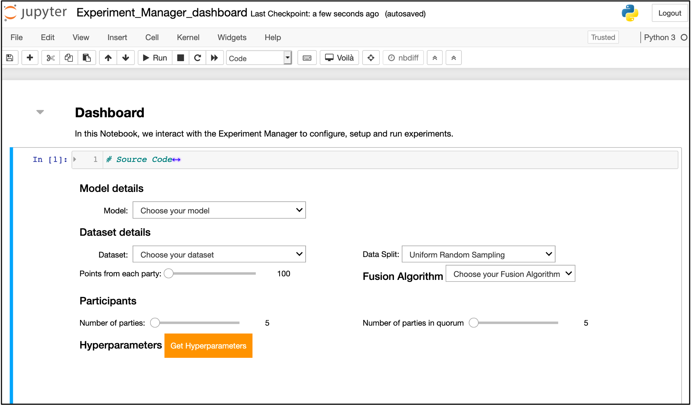

<i>Fig. 1: Experiment Manager Dashboard</i>

For better results, delete any extra cells in the Notebook. This allows the cell output to take up the whole of the remaining window. Otherwise it'd reduce in size, requiring you to scroll through the output.

#### Step 2: Choose the model
IBMFL supports a variety of models including _Keras_, _PyTorch_ and _Scikit-learn_ and you can choose your preferred model via the dropdown shown in the figure below.

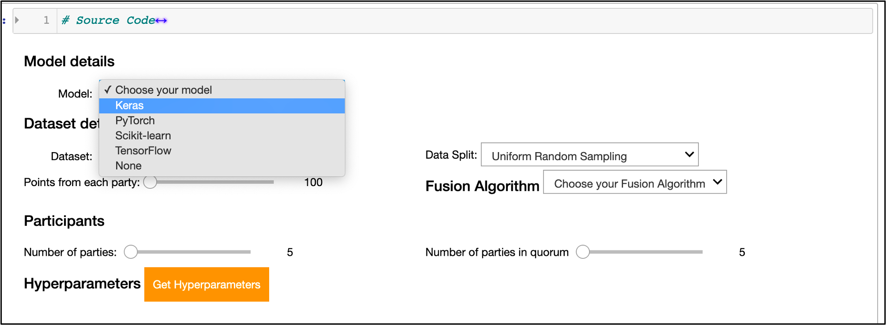

<i>Fig. 2: Choosing a Model from the dropdown</i>

While there may be an option for the users to upload their model in future, at this point only built-in models are supported. 

#### Step 3: Choose dataset
Once the model is chosen as in the previous step, the other dropdowns will get updated to reflect compatible options supported by the framework. Next, choose the dataset and splitting strategy (_uniformly random_, or _stratified_) to determine how the data must be split across parties.

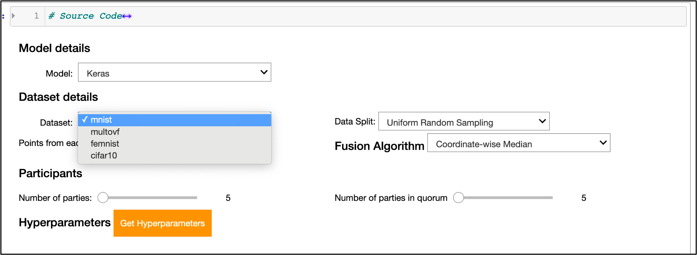

<i>Fig. 3: Choosing the dataset</i>

#### Step 4: Select Fusion Algorithm
Next, pick the Fusion Algorithm to be run for the experiment. The list shown in the dropdown reflects those supported for the Model and Dataset choices made in the previous steps.

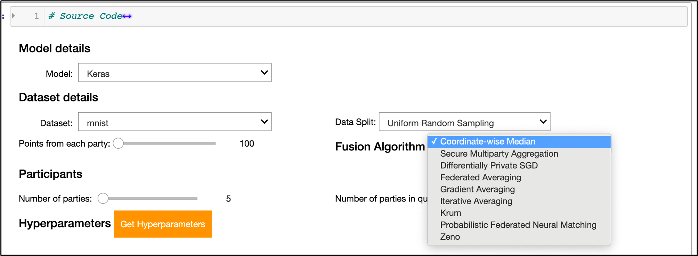

<i>Fig. 4: Choosing the Fusion Algorithm</i>

#### Step 5: Select number of participating parties
Next, choose the number of parties you’d like to have in the experiment, using the slider on the left. Additionally, you could use the slider on the right to choose the number of parties the aggregator will wait on (the *quorum*), when collecting responses. If left untouched, this will be equal to the number of parties chosen in the slider on the left.

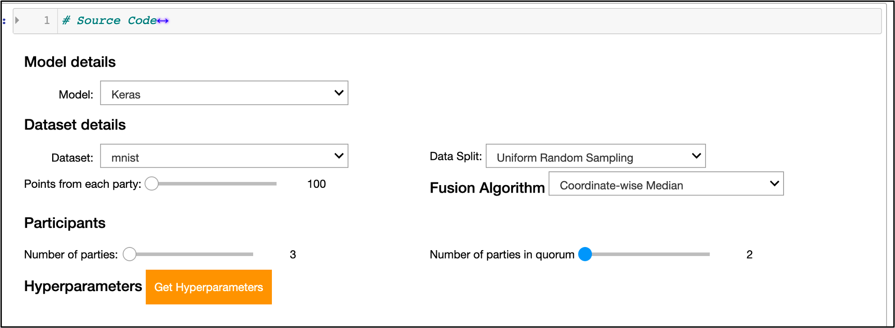

<i>Fig. 5: Choosing the number of parties</i>

Click the `Get Hyperparameters` button to view and modify the hyperparameters corresponding to the choices made so far.

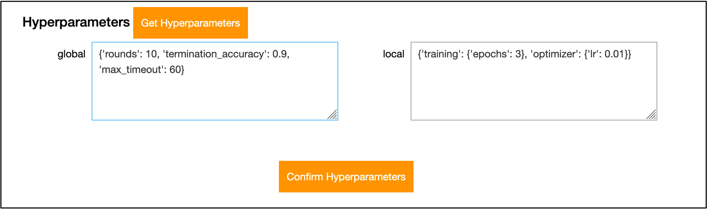

<i>Fig. 6: View/Modify the relevant hyperparameters</i>

Finally click on `Confirm Hyperparameters` to move on to the next screen.

#### Step 6: Run locally or on remote machines
Next, choose whether the experiment should be run *locally*, i.e., on the same machine as the dashboard; or *remotely*, i.e., across various remote virtual machines. In this document, we consider the `Run on Remote Machines` option, as it needs more details compared to the local run.

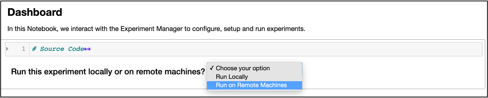

<i>Fig. 7: Run the experiment locally or on remote machines</i>

#### Step 7: Key in machine details
For the remote run, the dashboard needs `IP address`, `port number`, `SSH username`, the `IBMFL Dir` (IBMFL project root directory) and a `Staging Dir` (a staging directory where all configuration, dataset and logs should go -- for each of the machines. Prior to filling this in, check the appropriate option depending on whether the machines use `conda`, as well as the corresponding virtual environment path. 

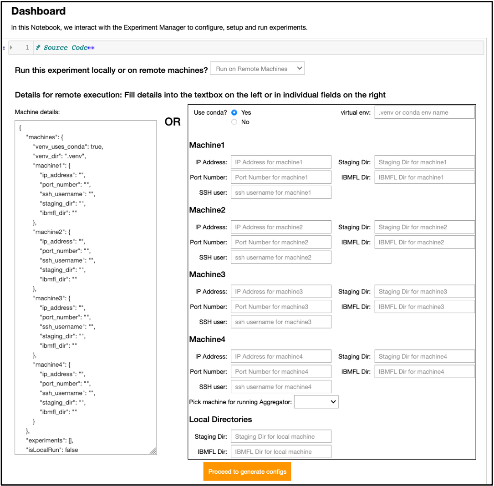

In the dropdown labelled `Pick machine for running Aggregator:`, select the machine where the Aggregator should be run. Finally, in the `Local Directories` section, add in the directories for the local `Staging Dir` and local `IBMFL Dir`. These should exist on the same machine where the dashboard Notebook is being run.

All this information can be keyed in either through the fields on the right or via a JSON as shown on the left.

Once done, click `Proceed to generate configs`.

#### Step 8: View Aggregator and Party configs
On the next screen, the `generate_data.py` and `generate_configs.py` scripts are invoked and the resulting aggregator and party0 files are displayed, as shown here.

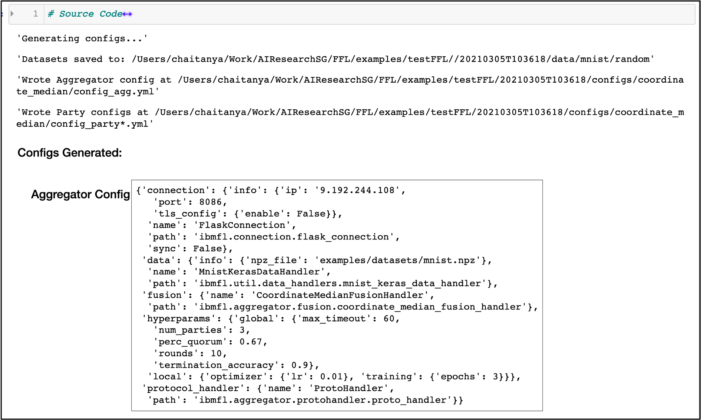

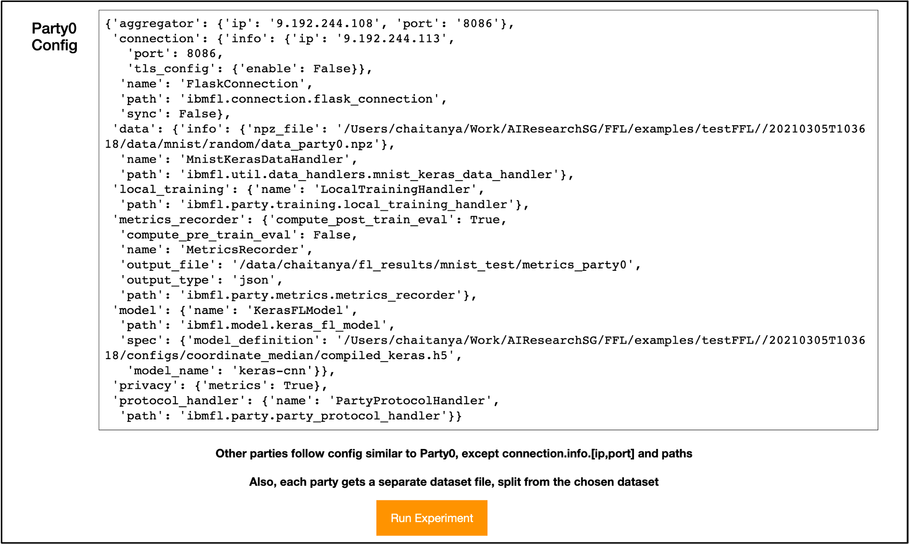

<i>Fig. 8: Aggregator and Party0 configs</i>

If the configs look alright, click `Run Experiment` to get things running and monitor progress.

#### Step 9: Monitor experiment and visualise results
Once the experiment begins running, details about each of the connections are printed with progress bars indicating progress made in terms of the number of rounds completed from the total as well as the number of party responses in each round.

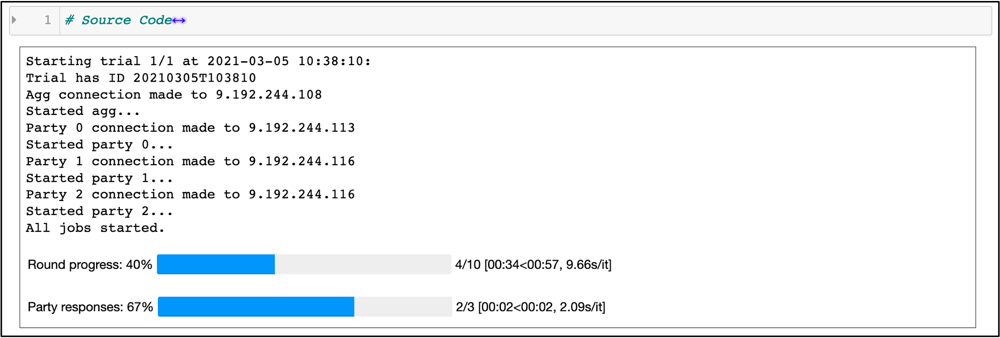

<i>Fig. 9: Monitoring progress during the experiment</i>

Once the experiment completes successfully, both the bars would be green and if post-processing of metrics is supported, a button labelled `Show Charts` will be visible.

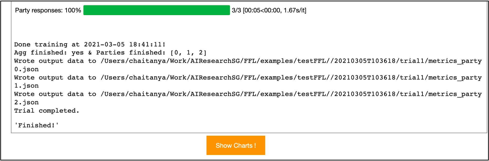

On clicking the button, you'll see loss and accuracy line plots for each party.

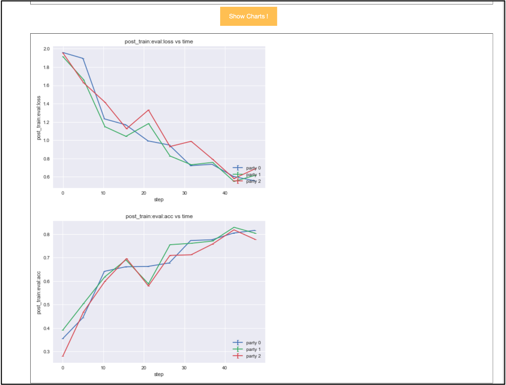

<i>Fig. 10: Plots from the experiment</i>

---